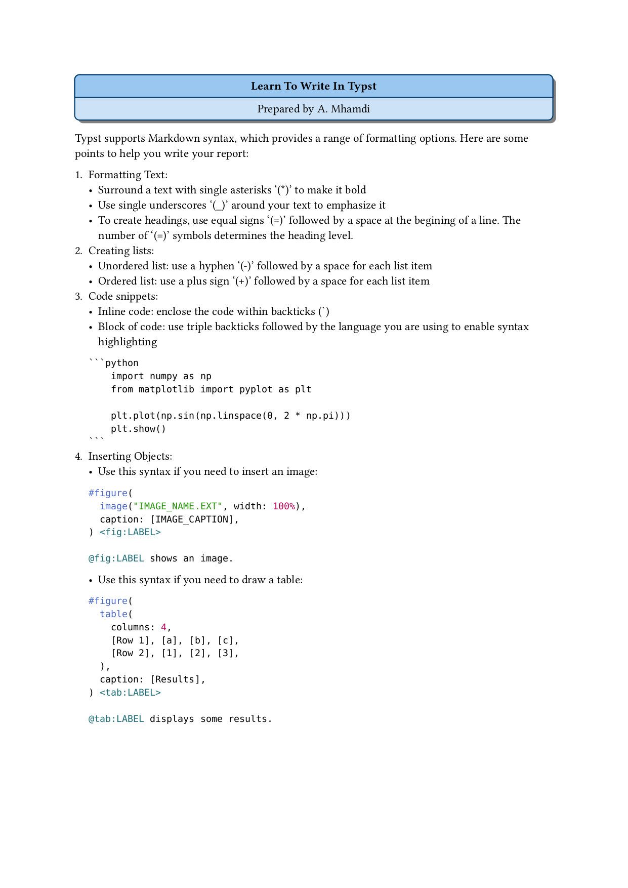

`Typst` version 0.12. was used to create the supplied templates.

The ebook at [https://sitandr.github.io/typst-examples-book/book/about.html](https://sitandr.github.io/typst-examples-book/book/about.html), offers a comprehensive guide and numerous `Typst` code snippets to help you generate quality documents.

